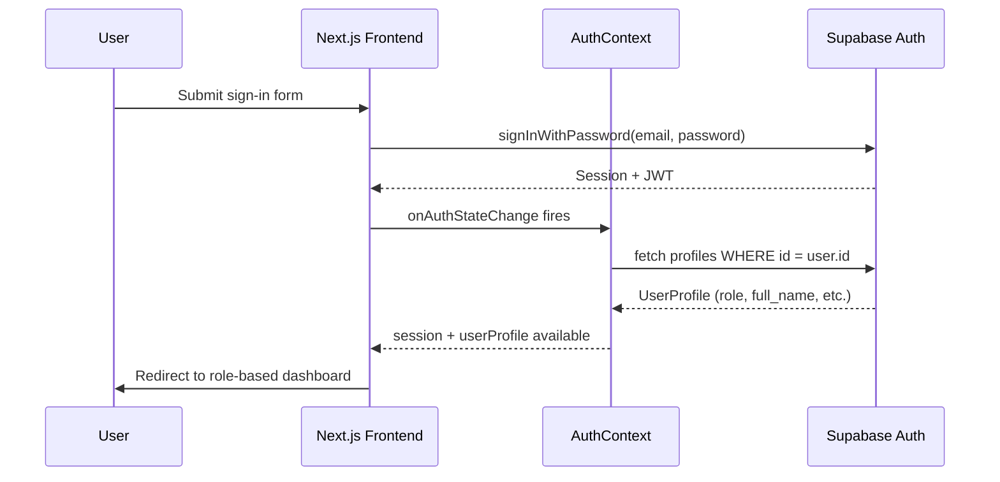
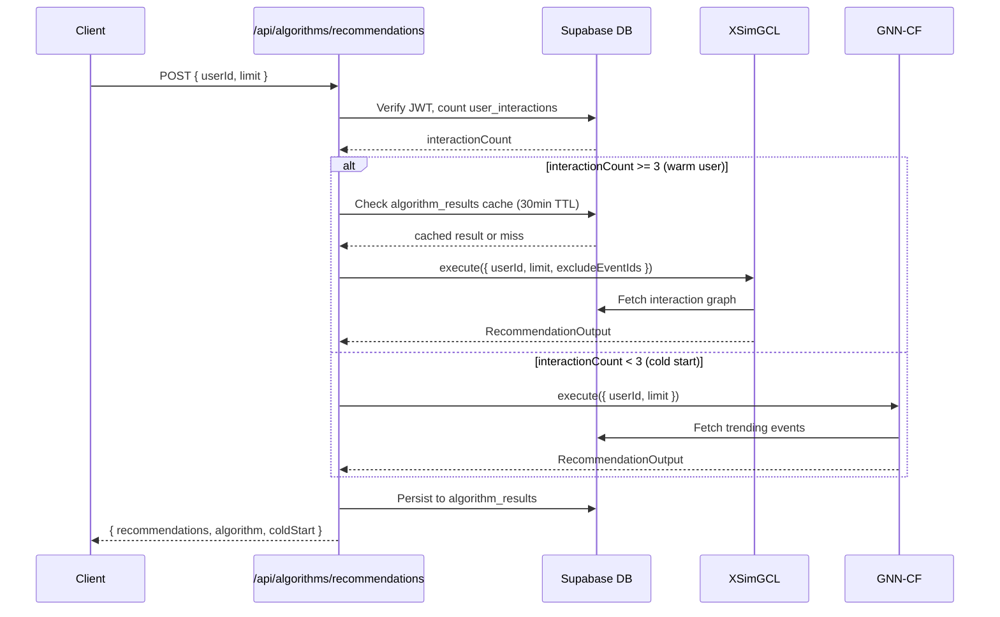

# Design Document: App Documentation

## Overview

EventMS is a full-stack event management platform built with Next.js 16, React 19, and Supabase. It serves three user roles (customer/organizer, vendor, admin), integrates five ML algorithms for recommendations, budget optimization, attendance forecasting, and community detection, and includes an AI-powered event chatbot. This documentation feature covers updating `README.md` to accurately reflect the current system and creating a structured `docs/` folder with technical reference documents for developers and contributors.

The platform has grown significantly beyond its original README — it now includes a sophisticated algorithm layer, a vendor marketplace, role-based dashboards, and a research/admin lab. The documentation must reflect this reality and serve both end-users and developers.

## Architecture

```mermaid
graph TD
    subgraph "Frontend (Next.js 16 App Router)"
        A[Landing Page] --> B[Auth Pages]
        A --> C[Events Browser]
        B --> D[Customer Dashboard]
        B --> E[Vendor Dashboard]
        B --> F[Admin Dashboard]
        D --> G[Event Detail Page]
        G --> H[AI Chatbot]
    end

    subgraph "API Routes"
        I[/api/chat]
        J[/api/algorithms/recommendations]
        K[/api/algorithms/budget-optimizer]
        L[/api/algorithms/forecast]
        M[/api/algorithms/communities]
        N[/api/admin/*]
        O[/api/geocoding]
        P[/api/chat-history]
    end

    subgraph "Algorithm Layer"
        Q[XSimGCL - Warm Recommendations]
        R[GNN-CF - Cold Start]
        S[MOEA/D-DRA-NEF - Budget Optimizer]
        T[iTransformer - Attendance Forecast]
        U[GAT+K-Means - Community Detection]
    end

    subgraph "Backend (Supabase)"
        V[(PostgreSQL + RLS)]
        W[Auth]
        X[Storage]
    end

    subgraph "External Services"
        Y[HuggingFace LLM API]
        Z[Gemini API]
    end

    D --> I
    D --> J
    D --> K
    D --> L
    D --> M
    F --> N
    J --> Q
    J --> R
    K --> S
    L --> T
    M --> U
    I --> Y
    Q & R & S & T & U --> V
    W --> V
    X --> V
```

## Sequence Diagrams

### User Authentication Flow



### Recommendation Request Flow



## Components and Interfaces

### Role-Based Dashboards

**Customer Dashboard** (`/customer-dashboard`)
- Tabs: My Events, Discover, Bookings, Vendors, Pro Team, Inquiries
- View modes: Grid, Calendar, Map
- Features: Event CRUD, RSVP tracking, vendor marketplace, AI recommendations, community filter, budget tracker

**Vendor Dashboard** (`/vendor-dashboard`)
- Service listing management
- Incoming service request handling (accept/reject/cancel)
- Earnings and booking overview

**Admin Dashboard** (`/admin-dashboard`)
- Algorithm Lab: run/evaluate all 5 ML algorithms
- BPR training trigger for XSimGCL embeddings
- Export reports (JSON, CSV, PDF) for research paper tables
- System health metrics and cache management

### Core UI Components

```typescript
// Key reusable components
interface EventCardProps {
  event: EventRow
  showFavorite?: boolean
  onEdit?: (event: EventRow) => void
  onDelete?: (id: string) => void
  onToggleFavorite?: (event: EventRow) => void
  trend?: "increasing" | "decreasing" | "stable"
}

interface RSVPButtonProps {
  eventId: string
  className?: string
}

interface EventFormDrawerProps {
  isOpen: boolean
  onClose: () => void
  event?: EventRow          // undefined = create mode
  onSubmit: (data: EventFormData) => Promise<void>
  isLoading: boolean
}
```

### API Route Interfaces

```typescript
// POST /api/chat
interface ChatApiRequest {
  message: string
  history: { role: "user" | "assistant"; content: string }[]
  eventId?: string
}

// POST /api/algorithms/recommendations
interface RecommendationRequest {
  userId: string            // UUID
  limit?: number            // 1–20, default 6
  excludeEventIds?: string[]
}

// POST /api/algorithms/budget-optimizer
interface BudgetOptimizerRequest {
  eventId?: string          // required for non-admins
  budget: number            // positive number (INR)
  requiredCategories?: string[]
}

// POST /api/algorithms/forecast
interface ForecastRequest {
  eventId: string
  horizon: 7 | 14           // days
  confidenceLevel?: number  // 0.80–0.99, default 0.95
}

// GET /api/algorithms/communities?eventId=xxx
// POST /api/algorithms/communities  (triggers recomputation)
```

## Data Models

### Core Database Tables

```typescript
// profiles — user accounts
interface Profile {
  id: string              // UUID, PK
  email: string
  username?: string
  full_name?: string
  avatar_url?: string
  bio?: string
  role: "customer" | "vendor" | "admin"
  created_at: string
  updated_at?: string
}

// events — all event data
interface Event {
  id: string              // UUID, PK
  user_id: string         // FK -> profiles.id
  event_name: string
  event_description?: string
  start_date: string      // YYYY-MM-DD
  start_time: string      // HH:MM
  end_date: string
  end_time: string
  visibility_type: "public" | "private" | "whitelist"
  event_status: "upcoming" | "ongoing" | "completed" | "cancelled"
  max_attendees?: number
  budget?: number         // INR
  venue_name?: string
  venue_city?: string
  venue_latitude?: number
  venue_longitude?: number
  schedules: EventScheduleData[]   // JSONB
  performers: EventPerformerData[] // JSONB
  faqs: EventFAQData[]             // JSONB
  tags: string[]
  gallery_images: string[]
  gallery_videos: string[]
}

// bookings — RSVPs
interface Booking {
  id: string
  event_id: string        // FK -> events.id
  user_id: string         // FK -> profiles.id
  status: "confirmed" | "cancelled" | "waitlist"
  created_at: string
}

// vendor_services — vendor offerings
interface VendorService {
  id: string
  vendor_id: string       // FK -> profiles.id
  service_name: string
  description?: string
  base_price?: number     // INR
  price_unit?: string     // "per_hour" | "per_event"
  category?: string       // "DJ" | "Catering" | etc.
  quality_score?: number  // 0–100, used by MOEA/D
  rating?: number         // 0–5
  images?: string[]
}

// service_requests — vendor hire requests
interface ServiceRequest {
  id: string
  event_id: string
  service_id: string
  requester_id: string
  vendor_id: string
  status: "pending" | "accepted" | "rejected" | "completed" | "cancelled"
  cancellation_requested_by?: "customer" | "vendor" | null
  message?: string
}

// algorithm_results — ML execution log (also used as cache)
interface AlgorithmResult {
  id: string
  user_id: string
  algorithm_type: "xsimgcl" | "gnn-cf" | "moea-d" | "itransformer" | "gat-kmeans"
  input_data: Record<string, unknown>
  output_data: Record<string, unknown>
  execution_time_ms: number
  version: string
  expires_at: string
}
```

### Additional Tables (Algorithm Support)

| Table | Purpose |
|---|---|
| `user_interactions` | Implicit signals (view, favorite, RSVP) used by XSimGCL/GNN-CF |
| `favorites` | Explicit favorites, synced with `user_interactions` |
| `attendance_forecasts` | iTransformer output cache (1hr TTL) |
| `event_communities` | GAT+K-Means output cache (30min TTL) |

## Algorithmic Pseudocode

### Recommendation Algorithm Selection

```pascal
ALGORITHM selectAndRunRecommendations(userId, limit, excludeEventIds)
INPUT: userId (UUID), limit (int), excludeEventIds (string[])
OUTPUT: RecommendationOutput

BEGIN
  interactionCount ← COUNT(user_interactions WHERE user_id = userId)
  isColdStart ← interactionCount < COLD_START_THRESHOLD (3)

  IF NOT isColdStart THEN
    cached ← QUERY algorithm_results
              WHERE user_id = userId
              AND algorithm_type = 'xsimgcl'
              AND created_at > NOW() - 30min
    IF cached AND cached.recommendations.length > 0 THEN
      RETURN cached
    END IF
    result ← XSimGCL.execute(userId, limit, excludeEventIds)
  ELSE
    result ← GNNCrossDomainCF.execute(userId, limit, excludeEventIds)
  END IF

  result ← applyCCRReranking(result)
  result ← attachExplainabilityReasons(result, userId, isColdStart)

  PERSIST result TO algorithm_results
  RETURN result
END
```

**Preconditions:**
- `userId` is a valid authenticated UUID
- `limit` is between 1 and 20
- Supabase client carries user's JWT (RLS enforced)

**Postconditions:**
- Returns at most `limit` recommendations
- Excludes all `excludeEventIds` and already-confirmed bookings
- Result is persisted to `algorithm_results` for caching and paper logging

### Budget Optimization (MOEA/D-DRA-NEF)

```pascal
ALGORITHM optimizeBudget(eventId, budget, requiredCategories)
INPUT: eventId (UUID), budget (number), requiredCategories (string[])
OUTPUT: { bundles: ParetoBundle[], paretoSize: int }

BEGIN
  vendors ← QUERY vendor_services
             WHERE base_price <= budget
             ORDER BY base_price ASC
             LIMIT 200

  IF vendors.length = 0 THEN
    RETURN { bundles: [], paretoSize: 0 }
  END IF

  candidates ← MAP vendors TO VendorCandidate {
    id, vendorId, serviceName, category,
    baseCost, qualityScore, rating
  }

  result ← MOEAD.execute({
    eventId, budget, requiredCategories, vendors: candidates
  })

  PERSIST result TO algorithm_results
  RETURN { bundles: result.bundles, paretoSize: result.paretoSize }
END
```

**Preconditions:**
- Caller is the event organizer OR an admin
- `budget` is a positive number
- Non-admins must provide a valid `eventId` they own

**Postconditions:**
- Returns 3–5 Pareto-optimal vendor bundles
- Each bundle is labelled (e.g., "Budget Pick", "Best Value", "Premium")
- Result logged to `algorithm_results` for paper Table III

## Key Functions with Formal Specifications

### `AuthContext.signIn(email, password)`

**Preconditions:**
- `email` is a valid email string
- `password` is non-empty

**Postconditions:**
- On success: Supabase session is set, `userProfile` is populated from `profiles` table
- On failure: throws `Error` with Supabase error message
- `userProfile.role` determines which dashboard the user is redirected to

### `eventsService.createEvent(data, userId, userEmail)`

**Preconditions:**
- `userId` matches authenticated session
- `data` passes `eventFormBaseSchema` validation
- `start_date` <= `end_date`

**Postconditions:**
- New row inserted into `events` table
- Returns `{ success: true, data: EventRow }` or `{ success: false, error }`
- `attendee_count` initialized to 0

### `POST /api/algorithms/recommendations`

**Preconditions:**
- Valid Bearer JWT in Authorization header
- `userId` in body matches authenticated user (enforced server-side)
- `limit` between 1 and 20

**Postconditions:**
- Returns `{ recommendations, algorithm, coldStart, executionTimeMs }`
- `algorithm` is either `"xsimgcl"` or `"gnn-cf"`
- Confirmed bookings are never included in recommendations
- Result cached for 30 minutes in `algorithm_results`

**Loop Invariants (CCR re-ranking):**
- All previously processed recommendations maintain their relative score ordering
- Capacity ratio and recency adjustments are applied monotonically

## Example Usage

### Creating an Event (Frontend)

```typescript
// In CustomerDashboardPage
const handleCreateEvent = async (data: EventFormData) => {
  const result = await eventsService.createEvent(data, userId, userEmail)
  if (!result.success) throw new Error(result.error?.message)
  mutateMyEvents() // SWR cache invalidation
}
```

### Fetching Recommendations

```typescript
// POST /api/algorithms/recommendations
const response = await fetch("/api/algorithms/recommendations", {
  method: "POST",
  headers: {
    "Content-Type": "application/json",
    Authorization: `Bearer ${session.access_token}`,
  },
  body: JSON.stringify({ userId, limit: 6, excludeEventIds: [] }),
})
const { recommendations, algorithm, coldStart } = await response.json()
```

### Running Budget Optimizer (Admin Test)

```typescript
// POST /api/algorithms/budget-optimizer (admin, no eventId required)
const response = await fetch("/api/algorithms/budget-optimizer", {
  method: "POST",
  headers: { Authorization: `Bearer ${adminToken}` },
  body: JSON.stringify({ budget: 50000, requiredCategories: ["DJ", "Catering"] }),
})
const { bundles, paretoSize } = await response.json()
```

### Environment Setup

```bash
# .env.local
NEXT_PUBLIC_SUPABASE_URL=https://your-project.supabase.co
NEXT_PUBLIC_SUPABASE_ANON_KEY=your-anon-key

# Server-side only (never expose client-side)
HF_TOKEN=your-huggingface-token
HF_MODEL=meta-llama/Llama-3.3-70B-Instruct
GEMINI_API_KEY=your-gemini-key

NEXT_PUBLIC_SITE_URL=http://localhost:3000
```

## Correctness Properties

*A property is a characteristic or behavior that should hold true across all valid executions of a system — essentially, a formal statement about what the system should do. Properties serve as the bridge between human-readable specifications and machine-verifiable correctness guarantees.*

### Property 1: Cold-start algorithm selection

*For any* user with fewer than 3 interactions, the recommendation API must always return `algorithm: "gnn-cf"` and never `"xsimgcl"`.

**Validates: Requirements 4.2**

### Property 2: Warm-user algorithm selection

*For any* user with 3 or more interactions, the recommendation API must always return `algorithm: "xsimgcl"` and never `"gnn-cf"`.

**Validates: Requirements 4.2**

### Property 3: Recommendation ownership enforcement

*For any* authenticated user, a recommendation request where `userId` in the body does not match the authenticated user's `id` must return a 403 response and no recommendation data.

**Validates: Requirements 2.2, 2.6**

### Property 4: Budget optimizer ownership enforcement

*For any* non-admin caller, a budget optimizer request that omits `eventId` or references an event not owned by the caller must be rejected.

**Validates: Requirements 2.2, 2.7**

### Property 5: Algorithm cache TTL consistency

*For any* algorithm result stored in `algorithm_results`, the `expires_at` field must equal `created_at` plus the documented TTL (recommendations: 30 min, forecast: 60 min, communities: 30 min).

**Validates: Requirements 4.3**

### Property 6: Private event exclusion from public lists

*For any* public event listing query, the result set must contain no events with `visibility_type = "private"`.

**Validates: Requirements 3.4**

### Property 7: RSVP status transition validity

*For any* booking, only the transitions `confirmed → cancelled` and `waitlist → confirmed` are valid direct state changes; a direct `cancelled → confirmed` transition must be rejected.

**Validates: Requirements 3.5**

## Error Handling

### Authentication Errors

**Condition**: Missing or expired JWT on protected API routes
**Response**: `401 Unauthorized` with `{ error: "Authentication required" }` or `{ error: "Invalid or expired token" }`
**Recovery**: Client redirects to `/signin`; `AuthContext` clears session state

### Algorithm Failures

**Condition**: ML algorithm throws during execution (e.g., insufficient data, DB error)
**Response**: `500 Internal Server Error` with `{ error: "...", details: "..." }`
**Recovery**: Frontend shows empty state or fallback content; error logged via `logger.error`

### Validation Errors

**Condition**: Request body fails Zod schema validation
**Response**: `400 Bad Request` with `{ error: "Invalid request", details: ZodFlattenedError }`
**Recovery**: Client-side form validation prevents most cases; API returns field-level errors

### Supabase / Database Errors

**Condition**: DB query fails (network, RLS policy violation, constraint violation)
**Response**: Propagated as `500` or `403` depending on error type
**Recovery**: `handleApiError` utility normalizes all DB errors to consistent response shape

## Testing Strategy

### Unit Testing Approach

Test individual algorithm utilities, schema validators, and service functions in isolation.

Key test targets:
- `eventFormBaseSchema` — validate all field constraints and coercions
- `userProfileSchema` — validate role enum and required fields
- Algorithm utility functions in `src/lib/algorithms/shared/`
- `error-handler.ts` — verify all error response shapes

### Property-Based Testing Approach

**Property Test Library**: fast-check

Properties to verify:
- For any valid `EventFormData`, `eventFormBaseSchema.parse(data)` never throws
- For any `budget > 0` and `vendors.length > 0`, MOEA/D returns at least 1 bundle
- For any `userId` with `interactionCount >= 3`, recommendations algorithm is always `"xsimgcl"`
- For any `userId` with `interactionCount < 3`, recommendations algorithm is always `"gnn-cf"`
- CCR re-ranking never increases the length of the recommendations array

### Integration Testing Approach

Test API routes end-to-end with a test Supabase project:
- Auth flow: sign up → verify email → sign in → profile fetch
- Event CRUD: create → read → update → delete (with ownership checks)
- RSVP flow: RSVP → confirm → cancel → waitlist promotion
- Recommendation pipeline: seed interactions → call API → verify algorithm selection

## Performance Considerations

- Algorithm results are cached in `algorithm_results` table to avoid re-running expensive ML on every request (30–60 min TTLs)
- Community detection uses an optimistic lock (`gat-kmeans-lock`) to prevent concurrent recomputation
- SWR is used throughout the frontend for client-side caching and revalidation
- `EVENT_FULL_QUERY` constant centralizes the Supabase select string to avoid over-fetching
- Leaflet map is loaded client-side only to avoid SSR bundle bloat
- Next.js Image component with remote pattern whitelisting for optimized image delivery

## Security Considerations

- All API routes validate JWT via `supabase.auth.getUser()` before processing
- Row Level Security (RLS) is enforced at the database level for all tables
- `userId` in request bodies is always cross-checked against the authenticated user (prevents IDOR)
- HuggingFace and Gemini API keys use server-side-only env vars (no `NEXT_PUBLIC_` prefix)
- Event context for the AI chatbot is fetched server-side to prevent client-side prompt injection
- Image remote patterns in `next.config.ts` whitelist trusted CDNs

## Dependencies

| Dependency | Version | Purpose |
|---|---|---|
| `next` | 16.0.3 | App framework, routing, SSR |
| `react` / `react-dom` | 19.2.0 | UI rendering |
| `@supabase/supabase-js` | ^2.81.1 | Database, auth, storage client |
| `@supabase/ssr` | ^0.8.0 | Server-side Supabase client for API routes |
| `zod` | ^4.1.13 | Schema validation (forms + API) |
| `react-hook-form` | ^7.67.0 | Form state management |
| `swr` | ^2.3.7 | Client-side data fetching and caching |
| `framer-motion` | ^12.23.25 | UI animations |
| `leaflet` / `react-leaflet` | ^1.9.4 / ^5.0.0 | Interactive event maps |
| `recharts` | ^3.8.0 | Algorithm result charts in admin dashboard |
| `date-fns` | ^4.1.0 | Date formatting and manipulation |
| `ml-matrix` | ^6.12.1 | Matrix operations for ML algorithms |
| `mathjs` | ^15.1.1 | Mathematical computations in algorithms |
| `simple-statistics` | ^7.8.9 | Statistical utilities for iTransformer |
| `react-markdown` | ^10.1.0 | Markdown rendering in AI chat responses |
| `lucide-react` | ^0.554.0 | Icon library |
| `tailwindcss` | ^4 | Utility-first CSS framework |
| `husky` + `lint-staged` | ^9 / ^16 | Pre-commit linting hooks |
