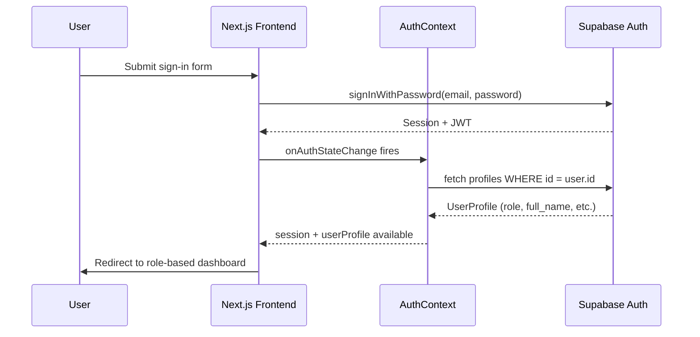

# Architecture Reference

EventMS is a full-stack event management platform built with Next.js 16 App Router, React 19, and Supabase. This document covers the system architecture, API routes, authentication flow, role-based access control, and dashboard structure.

See also:
- [docs/DATABASE_SCHEMA.md](./DATABASE_SCHEMA.md) — table definitions, column types, RLS policies
- [docs/ALGORITHMS.md](./ALGORITHMS.md) — ML algorithm details, pseudocode, caching strategy

---

## System Architecture

```mermaid
graph TD
    subgraph "Frontend (Next.js 16 App Router)"
        A[Landing Page] --> B[Auth Pages]
        A --> C[Events Browser]
        B --> D[Customer Dashboard]
        B --> E[Vendor Dashboard]
        B --> F[Admin Dashboard]
        D --> G[Event Detail Page]
        G --> H[AI Chatbot]
    end

    subgraph "API Routes"
        I[/api/chat]
        J[/api/algorithms/recommendations]
        K[/api/algorithms/budget-optimizer]
        L[/api/algorithms/forecast]
        M[/api/algorithms/communities]
        N[/api/admin/*]
        O[/api/geocoding]
        P[/api/chat-history]
    end

    subgraph "Algorithm Layer"
        Q[XSimGCL - Warm Recommendations]
        R[GNN-CF - Cold Start]
        S[MOEA/D-DRA-NEF - Budget Optimizer]
        T[iTransformer - Attendance Forecast]
        U[GAT+K-Means - Community Detection]
    end

    subgraph "Backend (Supabase)"
        V[(PostgreSQL + RLS)]
        W[Auth]
        X[Storage]
    end

    subgraph "External Services"
        Y[HuggingFace LLM API]
        Z[Gemini API]
    end

    D --> I
    D --> J
    D --> K
    D --> L
    D --> M
    F --> N
    J --> Q
    J --> R
    K --> S
    L --> T
    M --> U
    I --> Y
    Q & R & S & T & U --> V
    W --> V
    X --> V
```

---

## Authentication Flow

All protected API routes require a JWT issued by Supabase Auth. The token is passed as a Bearer token in the `Authorization` header.



After sign-in, the `role` field from the `profiles` table determines the redirect target:

| Role | Dashboard |
|---|---|
| `customer` | `/customer-dashboard` |
| `vendor` | `/vendor-dashboard` |
| `admin` | `/admin-dashboard` |

---

## Authorization Header Format

All protected routes expect:

```
Authorization: Bearer <jwt>
```

Where `<jwt>` is the `access_token` from the active Supabase session (`session.access_token`).

**Error responses:**
- `401 Unauthorized` — missing token: `{ "error": "Authentication required" }`
- `401 Unauthorized` — invalid or expired token: `{ "error": "Invalid or expired token" }`
- `403 Forbidden` — authenticated but insufficient role or ownership: `{ "error": "Forbidden" }`

---

## API Routes

### POST /api/chat

AI chatbot endpoint. Calls the HuggingFace LLM with optional event context fetched server-side.

**Auth:** Not enforced at the route level (event context is fetched server-side to prevent prompt injection).

**Request body:**
```typescript
interface ChatApiRequest {
  message: string
  history: { role: "user" | "assistant"; content: string }[]
  eventId?: string   // UUID — if provided, event data is injected into the system prompt
}
```

**Response:**
```typescript
interface ChatApiResponse {
  success: true
  response: {
    id: string           // UUID
    role: "assistant"
    content: string
    source: "AI"
    responseTime: number // ms
    timestamp: string    // ISO 8601
  }
}
```

**Error responses:** `400` (validation), `503` (HuggingFace unavailable), `500` (unexpected error).

---

### GET /api/chat-history

Returns the saved chat message history for a user/event pair.

**Auth:** Required.

**Query params:** `?eventId=<uuid>` (required)

**Response:**
```typescript
{
  success: true
  messages: ChatMessage[]
  count: number
}
```

**Additional methods on this route:**
- `POST /api/chat-history` — saves a single message to the history for a user/event pair. Body: `{ eventId: string, message: ChatMessage }`.
- `DELETE /api/chat-history?eventId=<uuid>` — clears the message history for a user/event pair.

---

### GET /api/geocoding

Proxy for the Nominatim (OpenStreetMap) geocoding API. Bypasses browser CORS restrictions and adds a valid `User-Agent`. Rate-limited to 30 requests per minute per IP.

**Auth:** Not required.

**Query params (search mode):** `?q=<address>&format=json&limit=5&addressdetails=1`

**Query params (reverse mode):** `?lat=<lat>&lon=<lon>&format=json&addressdetails=1`

**Response:** Nominatim JSON response (array of results for search, single object for reverse).

**Error responses:** `400` (missing params), `429` (rate limit exceeded), `500` (upstream error).

---

### POST /api/algorithms/recommendations

Selects and runs either XSimGCL (warm users) or GNN-CF (cold start) based on the user's interaction count. See [docs/ALGORITHMS.md](./ALGORITHMS.md) for algorithm details and the cold-start threshold.

**Auth:** Required. `userId` in the body must match the authenticated user (IDOR protection enforced server-side).

**Request body:**
```typescript
interface RecommendationRequest {
  userId: string           // UUID — must match authenticated user
  limit?: number           // 1–20, default 6
  excludeEventIds?: string[]
}
```

**Response:**
```typescript
{
  success: true
  recommendations: RecommendedEvent[]
  algorithm: "xsimgcl" | "gnn-cf"
  coldStart: boolean
  executionTimeMs: number
}
```

**Error responses:** `400` (validation), `401` (auth), `403` (userId mismatch).

Results are cached for 30 minutes in the `algorithm_results` table. See [docs/DATABASE_SCHEMA.md](./DATABASE_SCHEMA.md) for the table schema.

---

### POST /api/algorithms/budget-optimizer

Runs MOEA/D-DRA-NEF to produce 3–5 Pareto-optimal vendor bundles within the given budget. See [docs/ALGORITHMS.md](./ALGORITHMS.md) for the algorithm and bundle output format.

**Auth:** Required. Non-admin callers must provide an `eventId` they own.

**Request body:**
```typescript
interface BudgetOptimizerRequest {
  eventId?: string           // UUID — required for non-admins; optional for admins
  budget: number             // positive number (INR)
  requiredCategories?: string[]
}
```

**Response:**
```typescript
{
  success: true
  bundles: ParetoBundle[]    // 3–5 labelled bundles (e.g. "Budget Pick", "Best Value", "Premium")
  paretoSize: number
  executionTimeMs: number
}
```

**Ownership restriction:** Non-admin callers must own the event referenced by `eventId`. Admins may omit `eventId` entirely for testing. Violations return `403`.

**Error responses:** `400` (validation or missing `eventId` for non-admin), `401` (auth), `403` (not event owner), `404` (event not found).

---

### POST /api/algorithms/forecast

Runs the iTransformer attendance forecasting model for a specific event. Results are cached for 1 hour in the `attendance_forecasts` table.

**Auth:** Required. Caller must be the event organizer (ownership enforced).

**Request body:**
```typescript
interface ForecastRequest {
  eventId: string
  horizon: 7 | 14            // forecast horizon in days
  confidenceLevel?: number   // 0.80–0.99, default 0.95
}
```

**Response:**
```typescript
{
  success: true
  eventId: string
  predictions: {
    date: string             // YYYY-MM-DD
    predictedAttendance: number
    lowerBound: number
    upperBound: number
    confidence: number
  }[]
  trend: "increasing" | "decreasing" | "stable"
  recommendedCapacity: number
  executionTimeMs: number
  cached?: true              // present when result was served from cache
}
```

**Ownership restriction:** Only the event organizer can request a forecast. Returns `403` for other authenticated users.

**Error responses:** `400` (validation), `401` (auth), `403` (not organizer), `404` (event not found).

---

### GET /api/algorithms/communities

Returns community data from the `event_communities` cache. If `eventId` is provided, returns the community that event belongs to and a list of similar event IDs.

**Auth:** Optional (token accepted but not required).

**Query params:** `?eventId=<uuid>` (optional)

**Response (no eventId):**
```typescript
{
  success: true
  communities: EventCommunity[]
  numCommunities: number
  executionTimeMs: number
}
```

**Response (with eventId):**
```typescript
{
  success: true
  community: EventCommunity | null
  similarEventIds: string[]   // up to 6 IDs from the same community
  executionTimeMs: number
}
```

If the cache is empty, returns an empty `communities` array with a message to trigger computation via POST.

---

### POST /api/algorithms/communities

Triggers a full GAT+K-Means community recomputation on all upcoming public events. Uses an optimistic lock to prevent concurrent runs. Results are cached for 30 minutes in `event_communities`.

**Auth:** Optional (token accepted but not required).

**Request body (optional):**
```typescript
{
  geographicDecay?: boolean  // default true — enables geographic proximity weighting
}
```

**Response:**
```typescript
{
  success: true
  communities: EventCommunity[]
  numCommunities: number
  silhouetteScore: number
  singletonCount: number
  executionTimeMs: number
}
```

Returns `202 Accepted` if a computation is already in progress (lock held).

---

### POST /api/admin/evaluate

Runs the algorithm evaluation pipeline using a global 70th-percentile temporal train/test split. Computes NDCG@10, Precision@10, and forecasting metrics (MAE, RMSE, MAPE) against confirmed bookings as ground truth.

**Auth:** Required. Admin role only (`profiles.role = "admin"`). Returns `403` for non-admins.

**Request body:** None.

**Response:**
```typescript
{
  success: true
  metrics: {
    usersEvaluated: number
    meanGroundTruthSize: number
    meanNdcg10: number
    meanPrecision10: number
    meanNdcg10ColdStart: number
    baselineNdcg10: number
    baselinePrecision10: number
    baselineNdcg10ColdStart: number
    evaluationMethod: "global_temporal_cutoff_70pct"
    cutoffTimestamp: string
    forecasting: {
      mae: number
      rmse: number
      mape: number
      baselineMae: number
      baselineRmse: number
    }
  }
}
```

---

### POST /api/admin/simulate-ai

Generates XSimGCL predictions and iTransformer forecasts for all eligible users (those with bookings on both sides of the 70th-percentile temporal cutoff). Used to populate `algorithm_results` before running `/api/admin/evaluate`.

**Auth:** Required. Admin role only. Returns `403` for non-admins.

**Request body:** None.

**Response:**
```typescript
{
  success: true
  processed: number   // users with successful XSimGCL predictions
  total: number       // total eligible users attempted
  forecasts: number   // events with successful iTransformer forecasts
}
```

---

### POST /api/admin/train-embeddings

Runs the BPR (Bayesian Personalised Ranking) training loop on XSimGCL embeddings using all `user_interactions` data. Applies LightGCN propagation before BPR. Saves trained embeddings to `algorithm_results`.

**Auth:** Required. Admin role only. Returns `403` for non-admins.

**Request body (optional):**
```typescript
{
  epochs?: number   // 1–50, default 15
  lr?: number       // learning rate, default 0.005
}
```

**Response:**
```typescript
{
  success: true
  lossPerEpoch: number[]
  totalEpochs: number
  finalLoss: number
  interactionsUsed: number
  usersInGraph: number
  eventsInGraph: number
  executionTimeMs: number
}
```

---

### POST /api/admin/backfill-quality

Computes proxy quality scores for all `vendor_services` rows from real `service_requests` data. Formula: `quality_score = 0.5 × acceptanceRate + 0.3 × responseSpeed + 0.2 × normalisedValue`. Feeds MOEA/D with real trade-off signals.

**Auth:** Required. Admin role only. Returns `403` for non-admins.

**Request body:** None.

**Response:**
```typescript
{
  success: true
  vendorsProcessed: number
  servicesUpdated: number
  sampleScores: {
    vendorId: string        // first 8 chars
    acceptanceRate: string
    avgResponseHours: string
    qualityScore: string
  }[]
}
```

---

## Role-Based Access Control

### Roles

The `profiles.role` column holds one of three values: `"customer"`, `"vendor"`, or `"admin"`.

### Customer (organizer)

Customers create and manage events, RSVP to others' events, and access the ML-powered planning tools.

**Accessible routes and features:**
- `/customer-dashboard` — primary dashboard
- Event CRUD (own events only — ownership enforced by RLS and API-level checks)
- RSVP / booking management
- Vendor marketplace (`/customer-dashboard` → Vendors tab)
- `POST /api/algorithms/recommendations` — own `userId` only
- `POST /api/algorithms/budget-optimizer` — own events only (`eventId` required)
- `POST /api/algorithms/forecast` — own events only
- `GET /api/algorithms/communities` — read community data
- `POST /api/chat` and `GET /api/chat-history` — AI chatbot

### Vendor

Vendors list services and respond to service requests from customers.

**Accessible routes and features:**
- `/vendor-dashboard` — primary dashboard
- Service listing management (own `vendor_services` rows)
- Incoming service request handling (accept / reject / cancel)
- Earnings and booking overview

Vendors do not have access to the algorithm endpoints or admin routes.

### Admin

Admins have full access including all `/api/admin/*` routes and can call the budget optimizer without an `eventId`.

**Accessible routes and features:**
- `/admin-dashboard` — primary dashboard
- All `/api/admin/*` routes (evaluate, simulate-ai, train-embeddings, backfill-quality)
- `POST /api/algorithms/budget-optimizer` — `eventId` is optional for admins
- All algorithm and chat routes available to customers

### Route Access Summary

| Route | customer | vendor | admin |
|---|---|---|---|
| `POST /api/chat` | ✓ | — | ✓ |
| `GET /api/chat-history` | ✓ | — | ✓ |
| `GET /api/geocoding` | ✓ | ✓ | ✓ |
| `POST /api/algorithms/recommendations` | ✓ (own userId) | — | ✓ |
| `POST /api/algorithms/budget-optimizer` | ✓ (own eventId) | — | ✓ (no eventId required) |
| `POST /api/algorithms/forecast` | ✓ (own eventId) | — | ✓ |
| `GET /api/algorithms/communities` | ✓ | ✓ | ✓ |
| `POST /api/algorithms/communities` | ✓ | ✓ | ✓ |
| `POST /api/admin/evaluate` | — | — | ✓ |
| `POST /api/admin/simulate-ai` | — | — | ✓ |
| `POST /api/admin/train-embeddings` | — | — | ✓ |
| `POST /api/admin/backfill-quality` | — | — | ✓ |

---

## Role-Based Dashboards

### Customer Dashboard (`/customer-dashboard`)

The primary interface for event organizers and attendees.

**Tabs:**
- My Events — list of events the user has created; supports Grid, Calendar, and Map view modes
- Discover — public event browser with community filter and AI recommendations
- Bookings — RSVP and booking history
- Vendors — vendor marketplace for browsing and hiring vendor services
- Pro Team — manage collaborators on events
- Inquiries — incoming and outgoing service requests

**Features:**
- Event CRUD via `EventFormDrawer`
- Smart Budget Planner (calls `/api/algorithms/budget-optimizer`)
- Event Recommendations panel (calls `/api/algorithms/recommendations`)
- Attendance Forecast panel (calls `/api/algorithms/forecast`)
- Community filter (calls `/api/algorithms/communities`)
- AI chatbot on event detail pages (calls `/api/chat`)

### Vendor Dashboard (`/vendor-dashboard`)

The primary interface for service providers.

**Features:**
- Service listing management — create, edit, and delete `vendor_services` rows
- Incoming service requests — accept, reject, or cancel requests from customers
- Earnings overview — summary of confirmed and completed bookings

### Admin Dashboard (`/admin-dashboard`)

The research and operations interface.

**Features:**
- Algorithm Lab — run and inspect all five ML algorithms interactively
- BPR Training — trigger `/api/admin/train-embeddings` to retrain XSimGCL embeddings
- Simulate AI — trigger `/api/admin/simulate-ai` to generate predictions for evaluation
- Evaluate — trigger `/api/admin/evaluate` to compute NDCG@10, Precision@10, MAE, RMSE, MAPE
- Backfill Quality — trigger `/api/admin/backfill-quality` to recompute vendor quality scores
- Export reports — download algorithm results as JSON, CSV, or PDF for research paper tables
- System health metrics and cache management

---

## Cross-References

- For table schemas, column types, and RLS policies referenced by the API routes above, see [docs/DATABASE_SCHEMA.md](./DATABASE_SCHEMA.md).
- For algorithm inputs, outputs, pseudocode, caching TTLs, and the cold-start threshold, see [docs/ALGORITHMS.md](./ALGORITHMS.md).
